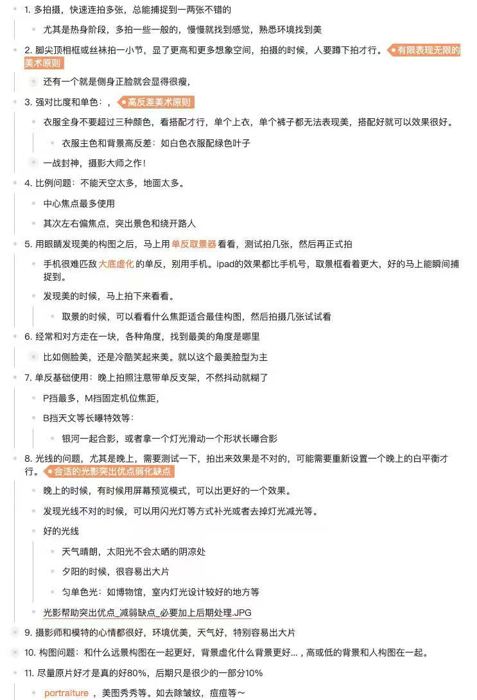

# 摄影与化妆的艺术

> 基于实战笔记整理的摄影与人像美学指南。核心理念：**一切美的背后都是数学** —— 对称、比例、节奏、反差、统一与变化。摄影与化妆，是用光影和色彩去拟合这些数学规律。

---

## 核心：数学之美（The Mathematics of Beauty）

> **美不是玄学，是可被度量、可被构造的几何与代数关系。** 摄影师的眼睛，就是在自然里寻找这些隐藏的数学结构；化妆师的笔，是在脸上重写这些几何关系。

### 1. 黄金比 φ ≈ 1.618 —— 最具张力的分割

- **黄金分割构图**：将画面按 0.618 : 0.382 分割，人脸/主体放在分割线上，比 50:50 居中更"对劲"
- **三分法（Rule of Thirds）**：黄金比的简化近似（≈ 0.667），把画面分成 3×3 九宫格，主体放在四个交点之一
- **斐波那契螺旋**：人脸轮廓、贝壳、花瓣、银河旋臂，都遵循 1, 1, 2, 3, 5, 8, 13... 的递增
- **化妆中的黄金比**：眉峰位置、唇峰高度、眼距与脸宽之比，越接近 φ 越被本能判断为"美"

### 2. 对称（Symmetry）—— 秩序的最高形式

- **双侧对称**：人脸的左右对称度越高，越被进化心理学认为是"健康/吸引"的信号
- **化妆的本质之一**：用阴影、高光、眼线，把不对称的五官重写为更接近对称的几何
- **镜面构图**：水面倒影、玻璃反射、双人对称姿势 —— 强迫画面进入数学的稳定态
- **打破对称**：完全对称是死的，**对称 + 一处破缺**才是活的（如蒙娜丽莎的微笑）

### 3. 比例与尺度（Proportion & Scale）

- **画面比例**：天 1 : 地 2 或 天 2 : 地 1，避开 1:1 的呆板（笔记原文："不能天空太多，地面太多"）
- **人体八头身**：理想人像头身比 1:8；蹲下拍可"拉长腿"，把比例从 1:6 拟合到 1:7+
- **三庭五眼**：脸部纵向三等分（发际线-眉-鼻底-下巴）、横向五眼宽 —— 化妆修容的数学基准
- **景别比例**：特写、半身、全身、远景的取舍，本质是主体占画面面积比的选择

### 4. 反差与对比（Contrast）—— 信息量最大化

- **色彩高反差**：白衣 + 绿叶、红唇 + 黑发 —— 互补色（色环 180°）让信号-噪声比最大化
- **明暗反差**：高调/低调照片，直方图分布越极端，戏剧感越强
- **虚实反差**：大底虚化（大光圈 f/1.4 ~ f/2.8）制造**主体清晰 / 背景模糊**的拓扑分离
- **化妆中的反差**：眼影深浅渐变、唇色与肤色的反差、卧蚕高光 —— 都是局部对比度的精修

### 5. 节奏与重复（Rhythm & Repetition）

- **几何重复**：栏杆、台阶、窗格、林荫道形成的等距重复 —— 大脑对周期信号有天然偏好
- **递进序列**：等差数列（楼梯）、等比数列（贝壳）、斐波那契（向日葵种子排列）
- **打破节奏**：一排穿白衣的人中一个穿红的 —— **重复 + 异常点** 才是焦点之所在

### 6. 统一与变化（Unity & Variation）

- 笔记原文："**衣服全身不要超过三种颜色**" —— 这是**色彩统一性**的硬约束
- 数学表达：在 HSL 色彩空间内，所有颜色应共享相近的 H（色相）或 S（饱和度）
- **同色系穿搭** = 色相方差小；**撞色穿搭** = 色相方差大但有刻意设计
- 化妆的"裸妆感"= 高统一性；"舞台妆"= 高变化性

### 7. 引导线与消失点（Leading Lines & Vanishing Points）

- **透视几何**：道路、河流、桥梁汇聚到消失点，把视线"算法式"地引导到主体
- **对角线构图**：比水平/垂直更具动感（向量方向 ≠ 重力方向）
- **S 形曲线**：身体姿态的 S 曲线 = 三段贝塞尔曲线的连续光滑

### 8. 光的物理（Physics of Light）

- **光线衰减**：点光源亮度 ∝ 1/d²（平方反比定律）—— 解释了为什么补光要近
- **色温**：开尔文（K）的数值线性映射到色相 —— 夕阳 ~ 3000K 暖，阴天 ~ 7000K 冷
- **入射角 = 反射角**：决定了高光位置 —— 化妆中"打高光"就是预测光线反射点
- **柔光 = 大面积光源**：阴凉处、阴天是天然柔光箱，减少阴影的硬边缘（频率分布更平滑）

---

## 一、拍摄数量哲学

- **多拍摄，快速连拍多张**，总能捕捉到一两张不错的
- 尤其是热身阶段，多拍一些普通的，慢慢就会找到感觉、熟悉环境、发现美
- **数学视角**：拍摄是采样，样本越多越接近真分布的最优解（蒙特卡洛思想）

## 二、构图：有限表现无限（美术原则）

- 脚尖顶框框、或者只拍丝袜一小节，能表现更高、更多想象空间
- 拍摄时，**人要蹲下去拍才行**（拉长身材比例至 1:8）
- 侧身正脸会显得很瘦（角度变化让宽度投影变小）
- **数学视角**：留白 = 信息论中的低熵区，给观者的想象腾出"信道带宽"

## 三、色彩：高反差美术原则

- 衣服全身不要超过三种颜色（**色彩统一性**约束）
- 单个上衣或单个裤子都无法表现美，**搭配好了才有效果**
- 衣服主色与背景高反差：如白色衣服配绿色叶子（**互补色对比 ≈ 色环 180°**）—— 一战封神，摄影大师之作

## 四、画面比例

- 不能天空太多，也不能地面太多（接近黄金比 1:1.618 或三分法 1:2）
- **中心焦点**最多使用（对称稳定）
- 其次左右偏焦点（三分法/黄金分割点），突出景色并绕开路人

## 五、取景器与构图发现

- 用眼睛先发现美的构图后，马上用**单反取景器**确认，测试拍几张，然后再正式拍
- 手机很难匹敌**大底虚化**的单反；别用手机（传感器面积差 10×+，景深方程决定）
- iPad 取景框比手机更大，更好瞬间捕捉到
- 取景时，多试几个焦距，找最佳构图（焦距决定透视压缩与背景虚化半径）

## 六、角度探索

- 经常对方正在一块，**各种角度**都试一遍，找到最美的那个
- 比如侧脸美，还是冷酷笑起来美 —— 就以这个最美脸型为主
- **数学视角**：3D 人脸在 2D 平面上的投影，存在一个最优视角使"对称-比例-黄金比"综合得分最高

## 七、单反基础使用

- 晚上拍照注意带单反**支架**，不然抖动就糊了（手持安全快门 ≈ 1/焦距 秒）
- **P 挡**最多使用（程序自动）
- **M 挡**固定机位焦距（全手动控制曝光三角：ISO/光圈/快门）
- **B 挡**用于天文等长曝特效：
  - 与银河一起合影
  - 拿一个灯光滑动，形成形状长曝合影（光绘 = 时间维度上的笔触积分）

## 八、光线：合适的光影突出优点、弱化缺点

- 晚上拍摄需要测试白平衡（色温映射的校准）
- 晚上有时候用屏幕预览模式，可以出更好的效果
- 发现光线不对时，可用闪光灯方式补光，或去掉灯光减光

**好的光线（按数学/物理性质分类）：**
- **阴凉处**（晴天）—— 散射光，频谱均匀，柔光箱效应
- **夕阳**（黄金时刻）—— 低色温 + 低入射角 = 长阴影 + 暖色调，戏剧感最大
- **匀色单色光**（博物馆/室内灯光设计较好的地方）—— 单一色温，无混色污染

> 光影帮助突出优点、减弱缺点 —— 必要加上后期处理（明暗高光位置 = 化妆修容的几何映射）

## 九、人的状态

- **摄影师和模特的心情**都很好、环境优美、天气好，特别容易出大片
- 微表情的几何 —— 眼轮匝肌的"杜兴微笑" 才是真笑的数学特征

## 十、构图搭配

- 和什么远景构图在一起更好、背景虚化什么背景更好
- 高或低的背景和人构图在一起（前景-中景-远景的三层深度）

## 十一、原片与后期

- **原片好才是真的好（80%）**
- 后期只是很小的一部分（10%）
- portraiture、美图秀秀等：去皱纹、痘痘等修饰（高频噪点滤除 = 双边滤波/频域分离）

---

## 十二、搭配的两种数学策略：统一 vs 高反差

> **核心命题：** 人 + 妆 + 衣 + 景，是一个四元组 (P, M, C, S)。要么让四者**色相/质感/风格的方差尽量小**（统一思想），要么让某一维度**方差尽量大**而其他维度保持锁定（高反差思想）。**最忌讳的是"半统一半反差"——既不和谐也不戏剧。**

### 1. 统一思想（Unity）—— 低方差美学

- **数学定义**：在 HSL 色彩空间 + 风格语义空间内，所有元素的协方差矩阵接近对角且方差小
- **适用场景**：日系、文艺、复古、婚纱、室内人像、需要"和谐感"的画面
- **判定标准**：摘掉任何一件单品换成同色系另一件，画面整体感不破

### 2. 高反差思想（High Contrast）—— 单维度爆破

- **数学定义**：锁定其他维度（如风格、明度），只在**一个轴**（通常是色相）上拉到极致
- **适用场景**：街拍、时尚大片、舞台、广告、需要"记忆点"的画面
- **判定标准**：闭上眼能回忆出**唯一的对比关系**（如"红裙 + 灰墙"）

> ⚠️ **二选一原则**：每张照片必须**明确归属一种**策略，混用会让画面塌成"灰泥"。

---

## 十三、男士搭配：发型 × 着装 × 背景

### A. 发型的几何分类

| 发型 | 几何特征 | 适配脸型 | 数学解释 |
| --- | --- | --- | --- |
| 短寸 / 板寸 | 头颅轮廓暴露 | 三庭比例好、骨相硬朗 | 去除高频细节，凸显低频几何 |
| 侧分油头 | 强引导线 + 反差 | 长脸 / 方脸 | 黄金比 7:3 分割顶部 |
| 中长卷发 | 软化轮廓 | 棱角过硬 | 高斯模糊脸部边缘 |
| 自然碎发 | 减龄、随机噪点 | 圆脸 / 学生气质 | 高频纹理打散硬轮廓 |
| 寸头 + 胡须 | 上短下重，三角稳定 | 下颌线清晰者 | 倒三角配重，重心下移 |

### B. 着装的统一策略（推荐 80% 场景）

- **三色封顶**：上衣 + 下装 + 鞋（或包/手表），不超过三种色相
- **同色系叠穿**：米白 + 卡其 + 浅咖（色相方差 < 30°）
- **质感统一**：全棉麻（文艺）/ 全西装毛料（商务）/ 全机能尼龙（街头）—— **不要混质感**
- **金属件统一**：表带 / 皮带扣 / 戒指 / 眼镜框 —— 全银或全金，不混搭

### C. 着装的高反差策略

- **黑白极简**：黑 T + 白裤 / 白衬衫 + 黑裤（明度 100% 反差，色相方差 0）
- **彩色撞墙**：莫兰迪墙 + 大红毛衣 / 蓝调街景 + 橙色外套（互补色 180°）
- **质感冲突**：粗花呢西装 + 白球鞋 / 真丝衬衫 + 工装裤（雅 vs 俗的张力）

### D. 男士 × 背景的常见组合

| 着装 | 推荐背景 | 策略 | 备注 |
| --- | --- | --- | --- |
| 白衬衫 + 卡其裤 | 绿叶 / 海边 / 白墙 | 统一（清爽） | 经典文艺青年 |
| 黑色全身 | 工业风、水泥墙、夜景霓虹 | 高反差（明度） | 注意补光，避免黑成一团 |
| 西装三件套 | 老建筑、图书馆、酒店大堂 | 统一（复古） | 黄金时刻拍最佳 |
| 机能风（黑/军绿） | 地铁、停车场、楼道 | 高反差（赛博） | 冷色调后期 |
| 米色风衣 | 秋叶 / 石板路 / 咖啡馆 | 统一（低饱和） | 阴天拍最稳 |
| 牛仔 + 白T | 草地、操场、复古车 | 统一（美式） | 蓝白绿三色经典 |

---

## 十四、女士妆容 × 着装 × 场景

### A. 妆容的两种范式

**统一型妆容（裸妆 / 日常 / 通勤）：**
- 底妆**降低对比度**：均匀肤色，去除高频瑕疵
- 唇 / 颊 / 眼影**同色系**：豆沙、奶茶、珊瑚 —— H 值接近
- 眉色**比发色浅 1 度**（统一中带柔化）
- **数学本质**：脸部各区域色彩协方差矩阵接近单位阵 × 小常数

**高反差妆容（约会 / 派对 / 拍摄）：**
- **唇色爆破**：正红 / 玫红 / 紫莓 —— 与肤色 / 衣服形成强对比
- **眼妆爆破**：烟熏 / 大地深邃 / 闪片 —— 眼周高对比聚焦
- **修容深刻**：山根 / 颧弓 / 下颌线 —— 强化 3D 几何
- **二选一规则**：唇和眼**只突出一个**，否则视觉中心冲突

### B. 妆容 × 着装的搭配矩阵

| 妆容风格 | 推荐着装 | 推荐背景 | 策略 |
| --- | --- | --- | --- |
| 奶油裸妆 | 米白针织 / 燕麦色 | 咖啡馆、米色墙、阳光房 | 统一（暖低饱和） |
| 冷调氛围妆 | 灰蓝 / 莫兰迪 | 雪景、玻璃幕墙、阴天海边 | 统一（冷低饱和） |
| 复古红唇 | 黑裙 / 白衬衫 | 老洋房、红砖墙、欧式街道 | 高反差（红 vs 黑/白） |
| 深邃烟熏 | 黑皮 / 金属感 | 夜店、霓虹、地下车库 | 高反差（明度极化） |
| 国风新中式 | 旗袍 / 棉麻 | 园林、老茶馆、青砖 | 统一（同朝代色谱） |
| 日系少女妆 | 学院风 / 白裙 | 樱花、校园、海边铁路 | 统一（高明度低饱和） |
| 港风浓妆 | 真丝吊带 / 西装 | 老式霓虹、扶手电梯、出租车 | 高反差（电影感色调） |

### C. 不同场地的女士搭配速查

- **海边 / 沙滩**：白色 / 米色长裙 + 草帽，裸妆 + 防水唇釉（统一—自然光下高饱和会过曝）
- **草地 / 森林**：大地色系连衣裙，棕色眼影 + 豆沙唇（统一—与环境同色谱）/ 红色裙（高反差—互补色 180°）
- **城市街拍**：纯色基础款 + 一件亮色单品（高反差—锁定灰调街景，单点爆破）
- **室内咖啡馆**：针织 + 长裤，奶茶妆（统一—暖色低饱和）
- **博物馆 / 美术馆**：极简黑白 / 单色裙（统一—不与展品争夺视觉中心）
- **古镇 / 园林**：新中式 / 旗袍，国风妆（统一—时代语义一致）
- **雪景**：红色外套 / 红围巾（高反差—白底唯一色块）/ 全白搭配（统一—极简留白）
- **夜景霓虹**：深色 + 一处金属反光元素，冷调妆（高反差—明度 + 色温）
- **婚礼 / 宴会**：缎面长裙 + 精致盘发，统一妆容（统一—避免抢新人风头）

---

## 十五、搭配的"算法流程"

> 拍摄前 10 分钟，按此顺序确认：

1. **定场地**（S）→ 量出背景的**主色 + 明度**
2. **选策略**：统一 还是 高反差？（写在便签上，强制自己锁定）
3. **配着装**（C）：若统一，C 取 S 的邻近色相；若高反差，C 取 S 的互补色或极端明度
4. **配妆容**（M）：M 跟随 C 的策略，**不要独立决策**
5. **配发型 / 配饰**：检查全身颜色 ≤ 3 种，金属件 ≤ 1 种
6. **取景器二次确认**：在单反 / iPad 取景框里看，色块是否还成立？
7. **拍摄**：若中途光线变化或环境变化，回到步骤 1 重新评估

> **一句话总结：** 统一是"全员同频共振"，高反差是"独奏者刺破伴奏"。最差的是"全员各自演奏不同曲子"——这就是大多数失败照片的根因。

---

## 化妆中的数学映射

| 化妆动作 | 数学/几何本质 |
| --- | --- |
| 修容（高光 + 阴影） | 在 2D 脸部重写 3D 光照模型，强化骨骼几何 |
| 眉形 | 黄金比定位眉头/眉峰/眉尾，三点确定一条贝塞尔曲线 |
| 眼线 | 眼睛长宽比的拉伸变换（仿射变换） |
| 唇形 | 三庭比例下的对称封闭曲线 |
| 腮红 | 黄金比例点的色相 + 饱和度低频涂抹 |
| 底妆 | 频域去噪（保留低频结构，去除高频瑕疵） |

---

## 核心要点速记

| 维度 | 关键 | 背后的数学 |
| --- | --- | --- |
| 数量 | 多拍、连拍 | 蒙特卡洛采样 |
| 构图 | 有限表现无限，蹲下拍 | 黄金比 / 三分法 / 留白熵 |
| 色彩 | 高反差、三色以内 | 互补色 / 色相方差约束 |
| 比例 | 中心焦点，避开天/地过多 | 八头身 / 三庭五眼 |
| 工具 | 单反 + 大底虚化 + 支架 | 景深方程 / 安全快门 |
| 光线 | 阴凉处 / 夕阳 / 匀色单色光 | 平方反比 / 色温 / 柔光散射 |
| 角度 | 多角度试拍 | 3D→2D 投影最优化 |
| 心境 | 摄影师与模特状态都好 | 杜兴微笑的肌肉几何 |
| 原片 | 80% 看原片，10% 看后期 | 频域分离：保结构、去噪 |
| 搭配 | 统一 或 高反差，二选一 | 协方差矩阵：低方差 / 单维度爆破 |

---

> **结论：** 摄影与化妆的艺术，归根结底是**用感性的眼睛去识别理性的数学规律**。对称是秩序，黄金比是张力，反差是信息，统一是和谐，节奏是预期，留白是想象。掌握了这些数学之美，按下快门或落下一笔时，便不再是偶然。
